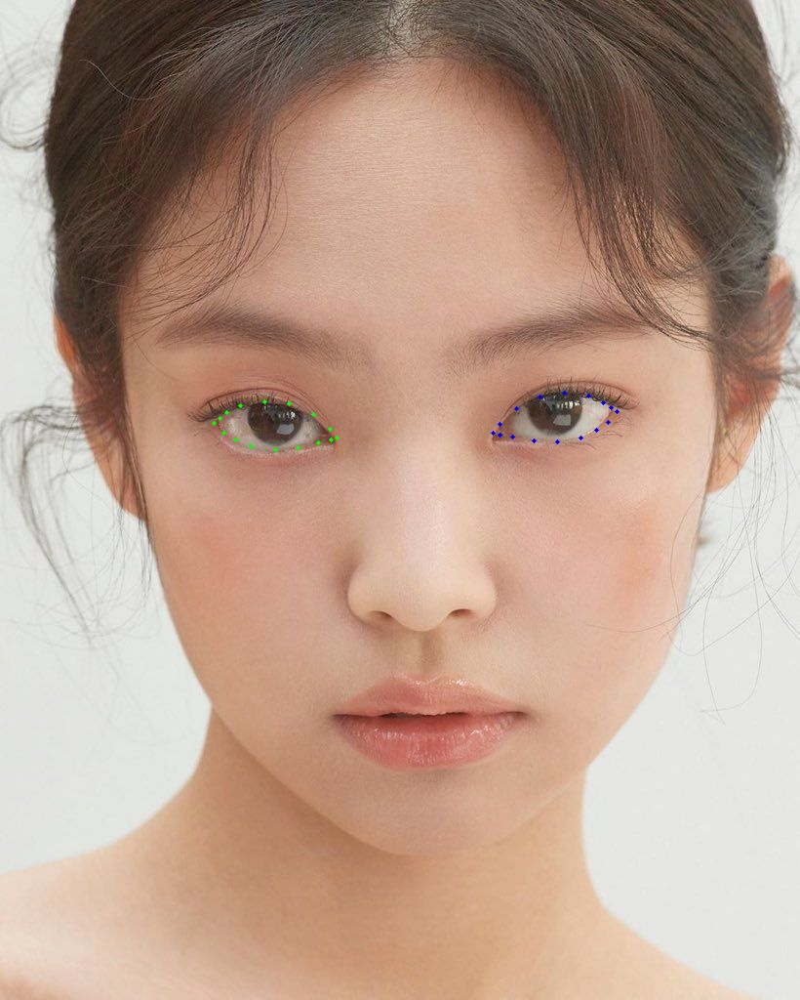

# Purpose
근거리 기기만을 사용한 실험을 원거리로 확장시키자. (가능하면 real-time)   

(pupil 연구)를 수행하기 위해서는 eye image가 필요함.  
따라서 cropped된 eye image를 output으로 할 수 있는 detection 모델을 만들자.  

먼저 RGB image로 detection model을 만들고, 후에 IR image로 fine-tuning. 

# Dataset
(pupil 연구)의 input image size = 224x224.  
원거리가 내가 생각하는 엄청 먼 거리까지를 의미는 아니고, (pupil 프로그램) 정도, 즉 웹캠 정도면 됨.  

(pupil 연구)에서 사용 중인 dataset
> CASIA

**사용할 모델(detection / landmark)가 정해져야 명확해질 거 같긴 함**
- face detection -> eye region
- eye detection
- landmark detection -> eye landmark    

### Face Detection
- MTCNN(2016)
- S3FD(2017): AFW / PASCAL Face
- RetinaFace(2019): AFLW
- DSFD(2019): WIDER FACE / FDDB
- TinaFace(2020)

### Landmark    

  
eye landmark 예시(mediapipe face mesh)

  
    
    
  

- 측면 데이터를 더 잘 잡음(내생각. 확실X)
- blink에 대해서도 계속 추적 가능함(내 생각이지만? 맞을 거 같음. 확실X)

(% 고민사항)  
- real-time을 고려했을 때, 가벼운 모델 사용해야 함.
- 측면에 대해서 detection과 landmark 성능을 비교해본 건 아님.
- 위 사항들이 걸림돌이 되지 않는다면 landmark 사용하는 게 좋을 거 같음(내 생각)

# Papers
### Face Detection

### Eye Detection

### Landmark
- **RT-GENE: Real-Time Eye Gaze Estimation in Natural Environments(ECCV, 2018)**
- **SPIGA: Shape Preserving Facial Landmarks with Graph Attention Networks(BMVC, 2022)**

# Implementation

  
오 이게 토글

  숨겨진 내용입니다.  
  여러 줄도 가능하고, 마크다운 문법도 함께 쓸 수 있어요!

  - 리스트도 되고
  - **굵은 글씨**, _기울임_ 등도 다 됨!

