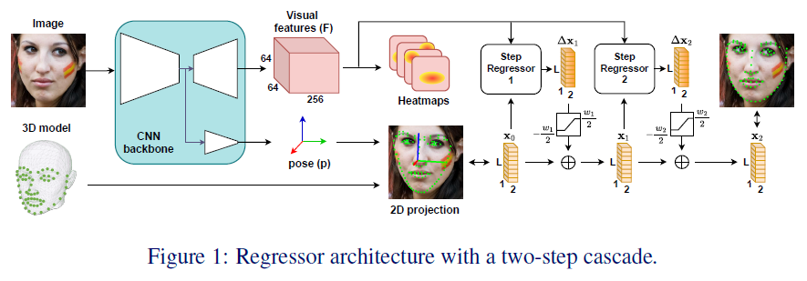
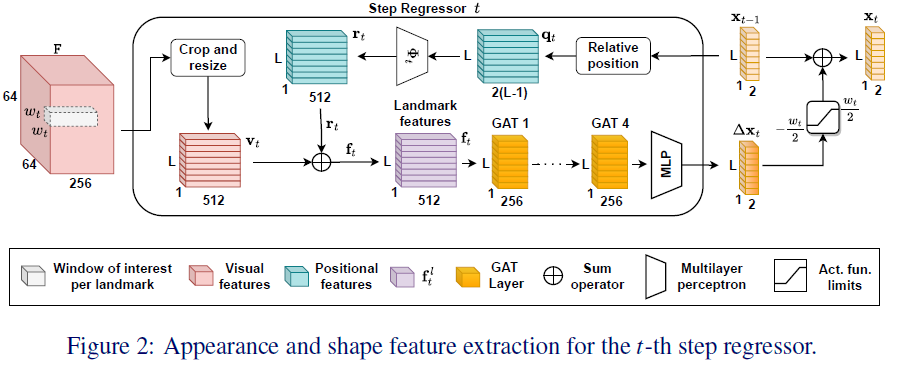

단순 읽기

# SPIGA: Shape Preserving Facial Landmarks with Graph Attention

## 1. Introduction

Top facial landmark estimation methods: coordinat / heatmap

- Coordinate regression approach
    - 인코더만 사용. 계산 효율성 높음.
- Heatmap regression approach
    - 인코더-디코더 모듈. landmark 위치 확률 최댓값 이용.
    - 정확도는 높으나, 계산량, 메모리 사용량 증가.

▲ 위 방식들의 한계

- ambiguity & noise에 매우 취약함.
    - CNN이 spatial 정보를 잘 학습하지 못하기 때문 -> facial landmark에서 face structure의 global represenatation을 학습 못함.

▲ 이러한 문제를 해결하기 위한 방법들은 있었음.

- Graph Convolutional Network(GCN)
    - landmark local 묘사 + 상대적인 landmark 위치로 표현된 geometrical 정보
    - 초기화 부정확성 & 정교한 attention 메커니즘 부족 => 성능 ㄴㄴ

⇒ **SPIGA**

- - traditional regressor cascade approach
    
    공부할 예정.
    
- - multi-stage heatmap backbone with a cascade of Graph Attention Network(GAT) approach를 결합한 algorithm
    
    공부할 예정.
    

backbone은 facial apprearance 표현에 top-performing

cascaded GAT regressor는 positional encoding + attention mechanism 활용하여 geometrical relationship 학습

추가 제안: GAT cascade의 수렴 향상을 위해 coarse-to-fine feature extraction 절차 + good 초기화

이를 위해 backbone training with a multi-task approach ← head pose도 추정 & head pose의 projection을 이용하여 초기 landmark 위치 설정

---

## 2. Shape Regressor Model

propose 얼굴 shape을 유지하면서 landmark coordinate를 점진적으로 조정하는 a coarse-to-fine cascade of landmark regressor

3가지 주요 요소

1. 초기화
2. 회귀에 사용되는 특징
3. cascade의 각 step에서 얼굴 shape 추정하는 regressors

---

use a multi-task CNN backbone to provide both, 초기화 & local appearance representation

초기 face shape  $\mathbf{x}_0 \in \mathbb{R}^{L\times 2}$는 head pose backbone 예측을 기반으로 포괄적인 3D rigid face mesh로부터 L개의 landmarks를 projection 함으로써 설정됨.

각 cascade step에서, GAT 기반 regressor는 landmark 위치를 update하기 위해 변위 벡터($\Delta \textbf{x}_t$) 계산함. ($\textbf{x}_t = \textbf{x}_{t-1}+\Delta \textbf{x}_t$)

K steps 후, 최종 face shape은 $\textbf{x}_K = \textbf{x}_0 + \sum _{t=1}^{K}\Delta \textbf{x}_t$.

t step에서 $l$번째 landmark의 2D 좌표: $\textbf{x}_{t}^{l}\in \mathbb{R}^2$

---
---
### 2.1 Initialization by Head Pose Estimation

Multi-task backbone(Multi Task Network, MTN)은 M개의 encoder-decoder Hourglass(HG) 모듈의 cascade임.

각 HG 모듈은 shared encoder with two task branches로 구성

1. 3D head pose estimation branch
2. landmark estimation decoder, 그 끝에는 다음 HG 모듈에 붙일 거임.

3개 요소의 depth를 정의하고 균형 잡는 것은 head pose estimation의 중요한 요소임.

h번째 모듈 pose head를 estimation과 gt 비교함으로써 supervise, L2 loss 이용.

$p \in \mathbb{R}^6 \leftrightarrow \tilde{p}$          $\pounds _p^h(p, \tilde{p})=||\tilde{p}-p||^2$

$\tilde{p}$는 rigid head model 이용하여 얻음.

landmark estimation에서는 local attention mechanism($\pounds_{att}$) on the heatmaps에 의해 향상된 coordinate smooth L1 loss($\pounds_{coord}$)를 이용하여 학습.

final landmark loss =  $\pounds_{lnd}=\sum_{M}^{h=1}(\lambda _c \pounds _{coord}^h + \lambda _att \pounds _{att}^h)$          람다는 실험적으로 얻은 스칼라 값.

---

pretrain the network only with the landmark task $\pounds_{lnd}$

fine-tune with both tasks, landmarks & pose

multi-task fine-tuning에서는  $\pounds_{mt}= \pounds_{lnd} + \lambda _p\sum_{h=1}^{M} 2^{h-1} \pounds _p^h$              람다는 하이퍼파라미터.

모든 HG 모듈에 intermediate supervision 쓰지만, $\textbf{x}_0$ 추정하기 위한 예측 $p$와 visual features는 마지막 모듈에서 추출됨.

3D head model에서의 landmark는 $X\in \mathbb{R}^{L\times 3}$일 때, 백본에 의해 추정된 pose가 $p$일때,

초기 shape $\textbf{x}_0$는 $\mathbf{x}_0=\pi(X;p)$로 계산되어, 3D → 2D projection.

---
---

### 2.2 Geometric and Visual Feature Extraction

cascaded regrssor의 각 step 마다, input features는 local appearance at each landmark (visual features)+ global representation of the facial structure (geometric features)

마지막 HG 모듈의 output feature map을 F라 하자.

local appearance information: F에서 각 landmark location에서 $\textbf{x}_{t-1}^l$을 중심으로 하는  $w_t \times w_t$ 사이즈의 $W_t$ 정사각형 window로부터 얻음.

use a fixed affine transform with a grid generator and sampler를 사용하여 crop and re-sample $W_t$.

convolutional layers 이용하여 visual features $\textbf{v}_t^l$ 추출. 

coarse-to-fine 접근법으로, 각 step마다 점차 reduce $w_t$.

---

위치 정보는 local appearance가 충분하지 않을 때 face shape 유지에 중요함.

landmark 사이의 상대적 거리는 enhanced geometrical features를 제공함. (absolute locations와 비교해서)

상대적 위치 정보는 landmark 사이의 변위 벡터로부터 정의될 수 있음.

$\textbf{q}_t^l=\{\textbf{x}_{t-1}^l -\textbf{x}_{t-1}^i\}_{i \neq l} \in  \mathbb{R}^{2\times(L-1)}$을 변위 벡터라 하자.

Multi layer Perceptron(MLP)를 이용하여 $\textbf{q}_t^l$로부터 high dimensional embedding 배움. (즉, 변환) ($\textbf{r}_t^l=\Phi _t(\textbf{q}_t^l)$)

이는 visual local appearance, facial shape information 결합 용이하게 함.

$\textbf{f}_t^l$는 $\Delta \textbf{x}_t^l$ 계산하기 위해 사용되는 feature vector.

cascade의 각 setp, 각 landmakr에서, backbone network로부터 추출한 visual features($\textbf{v}_t^l$)를 relative positive features($\textbf{r}_t^l$)를 추가하여 encoded features  $\textbf{f}_t^l=\textbf{v}_t^l+\textbf{r}_t^l$을 얻음.

---
---
### 2.3 Cascade Shape Regressor Using GATs

 

step regressor 아키텍처는 Attentional Graph Neural Net에서 영감받은 GAT 층들이 stacked 되어 구성됨.

우리는 facial shape을 하나의 densely connected graph로 생각. (노드들은 landmark location  $\textbf{x}_t$)

노드들 간에 공유된 정보를 weight하기 위해, 각 GAT 레이어 $s$마다 dynamic adjacency matrix($\textbf{A}_t^s$) 계산.

주어진 landmark에서 그래프 내 다른 모든 landmark로 향하는 attention으로써 행렬을 학습함.

t step 에서 첫 번쨰 GAT layer의 input은 encoded features. ($\{ \textbf{f}_t^i \}_{i=1}^L$) 

(s-1) 번째 GAT layer에서 생성된 i 번째 landmark의 features. ($\textbf{f}_t^{i, s-1}$) 는 s 번째 layer의 input임. 

s번째 layer 이후 update된 feature vector $\textbf{f}^{i, s}=\textbf{f}^{i, s-1} + MLP([\textbf{f}^{i, s-1} || \textbf{m}^{i, s}])$      

$[\cdot || \cdot ]$: concatenation operator      $\textbf{m}^{i, s}$: information aggregated, or message of the nodes neighboring i.

메시지 생성 과정

노드 i에는 query vector $\textbf{h}_q^{i,s}$ , 다른 landmark j에는 key vector $\textbf{h}_k^{i, s}$와 value vector $\textbf{h}_v^{i,s}$ 부여

landmark i → j로의 attention weight는 Softmax over the key-query similiarities $\alpha _{ij} = SoftMax_j(\textbf{h}_q^{i,s}  \textbf{h}_k^{j,s})$

$\alpha_{ij}$는 adjacency matrix $\textbf{A}_t^s$의 원소 

전달되는 message $\textbf{m}^{i, s}$는 weighted average of the value vectors: $\textbf{m}^{i, s} = \sum _{i \neq j}\alpha _{ij}\textbf{h}_v^{j, s}$

$\textbf{h}_q^{i,s} = \textbf{W}_1^s \textbf{f}^{i, s} + \textbf{b}_1^s$, $\textbf{h}_k^{j,s} = \textbf{W}_2^s \textbf{f}^{j, s} + \textbf{b}_2^s$, $\textbf{h}_v^{j,s} = \textbf{W}_3^s \textbf{f}^{j, s} + \textbf{b}_3^s$

Matrices $\textbf{W}_i$, bias vectors $\textbf{b}_i$

마지막 GAT 계층 output $\textbf{f}_t^{i, 4}$는 decoder 역할을 하는 MLP에 전달되어 obtain 해당 변위 $\Delta \textbf{x}_t^i$ 

$\Delta \textbf{x}_t^i$ 값은 ArcTan activation과 scaling 거쳐 $[-w_t/2, w_t/2]$로 제한됨.

이 값의 제한은 single-step regressor search problem을 단순화, training convergence를 가속함.

MTN backbone이 학습된 상태에서, 우리는 train the cascade with the loss $\pounds _{CR}=\sum_{t=1}^{K}L1_{smooth}[\tilde{\textbf{x}} - (\textbf{x}_{t-1} + \Delta \textbf{x}_t)]$

---

---

## Introduction
- CNN은 spatial 정보를 잘 학습하지 못하기 때문에 face structure의 global representation을 학습할 수 없음.  
  이 때문에 ambiguity or noise contamination에 취약함. (occlusion, heavy make-up, blur and extreme illuminations or poses)  
    CNN이 local하게 동작하니까, 멀리 떨어진 landmark 간의 관계를 잘 포착할 수 없음.    
  - 얼굴은 structured object이기 때문에 landmark끼리는 연관성이 있기 때문에 이를 고려해주어야 함.  
  
  이를 개선하고자 한 방법들은 존재했지만, poor Initialization & advanced attention mechanism 부족 문제 때문에 성능 향상 기대 힘듦.

**그래서 SPIGA 제안**    
- traditional regressor cascade approach & algorithm(multi-stage heatmap backbone + cascade of GAT regressors)  
    - backbone: top-performing facial appearance representation
    - cascaded GAT regressor: geometrical relationship among landmarks
    - coarse-to-fine feature extraction procedure & good Initialization

## Shape Regressor Model
- multi-task CNN backbone (for the Initialization & the local appearance represenatation)
- face의 초기 shape: $\textbf{x}_0 \in \mathbb{R}^{L \times 2}$ 
    - L개의 landmark에 대해서, backbone에서 predict한 pose를 이용하여 3D rigid face mesh로부터 proejction 됨.
- GAT regressor는 변위 벡터 $\Delta \textbf{x}_t$ 를 업데이트하며 landmark location 수정.

## Initialization by Head Pose Estimation
- MTN은 M(=4)개의 Enc-Dec (HG module)의 cascade 구조
    - 각 HG module의 two task branch 끼리는 shared encoder.
        - 3D head pose estimation  
        h번째 module head pose는 L2 loss $\mathcal{L}_{\mathbf{p}}^{h}(\mathbf{p}, \tilde{\mathbf{p}}) = \|\tilde{\mathbf{p}} - \mathbf{p}\|^2.
$  
        ($\tilde{\mathbf{p}}$는 3D rigid head model 사용해서 얻음)
        - landmark estimation decoder  
        heatmap 상에서 중요 landmark에 더 집중하도록 하는 방법으로 향상시킨 smooth L1 loss를 이용하여 coordinate 최적화 진행 (**Adaptive Wing Loss 읽어봐야 할 듯**)  
        최종 loss $\mathcal{L}_{\text{Ind}} = \sum_{h=1}^{M} 2^{h-1} \left( \lambda_c \mathcal{L}_{\text{coord}}^h + \lambda_{\text{att}} \mathcal{L}_{\text{att}}^h \right)
$, ($\lambda$는 각각 4, 50)

1. landmark task만을 이용하여 pretrain the network  
last HG 모듈에서 p를 추출.   
3D model에 p를 대입하여 3D -> 2D projection하여 $\textbf{x}_0$를 얻음.
2. fine-tune with tasks(landmark & pose)

## Geometric and Visual Feature Extraction
cascaded regressor의 각 step에서의 input features = local apprearance(visual features) at each landmark + global representation(geometric features) of the facical structure  

- Local appearance(visual)  
    - MTN에서 마지막 HG module의 output feature map = F   
        F에서 landmark 위치 $\textbf{x}_{t-1}^l$을 중심으로, $w_t \times w_t$ 사이즈의 Window $W_t$로부터 local appearance 정보 추출. ($w_t$는 iteratively reduce. coarse-to-fine)  
        Use a fixed affine transform with the grid generator and sampler of the Spatial Transformer Networks to have a differential crop operation of $W_t$  
        ($w_t$ 사이즈와 상관없이, fixed size 7x7x256 $W_t$) 
    - convolutional layers 이용하여 visual features $\textbf{v}_t^l$ 추출

- Positional information(global represenatation)  
    - landmark 사이의 상대적 거리는 enhanced geometrical features 제공  
        - landmark의 absolute location은 사진 위치, 회전 등의 이유로 사진에 따라 location 값이 달라짐.
        - face의 landmark 간 비율은 일정 -> 상대적 위치를 가짐
        - 상대적 위치를 이용하여 face structure의 전체 구조 파악 용이  
    - 상대적인 positional information은 landmark 사이의 변위 벡터로 정의될 수 있음.    
        - 변위 벡터: $\mathbf{q}_t^l = \left\{ \mathbf{x}_{t-1}^i - \mathbf{x}_{t-1}^l \right\}_{i \ne l} \in \mathbb{R}^{2 \times (L - 1)}$  
        - MLP를 이용하여 $\mathbf{q}_t^l$로부터 고차원 embedding 학습, $\mathbf{r}_t^l = \Phi_t \left( \mathbf{q}_t^l \right)$  
        - $\mathbf{r}_t^l$ 이놈이 visual local appearance와 facial shape information 통합을 용이하게 함.  
    - $\Delta \textbf{x}_t$ 계산을 위한 feature vector $\textbf{f}_t^l$ 추가
        - ($\textbf{x}_{t-1}$로부터 계산) backbone으로부터 추출된 visual features $\textbf{v}_t^l$과 relative positional features $\textbf{r}_t^l$ 통해서 encoded feature $\mathbf{f}_t^l = \mathbf{v}_t^l + \mathbf{r}_t^l$

## Cascade Shape Regressor Using GATs
